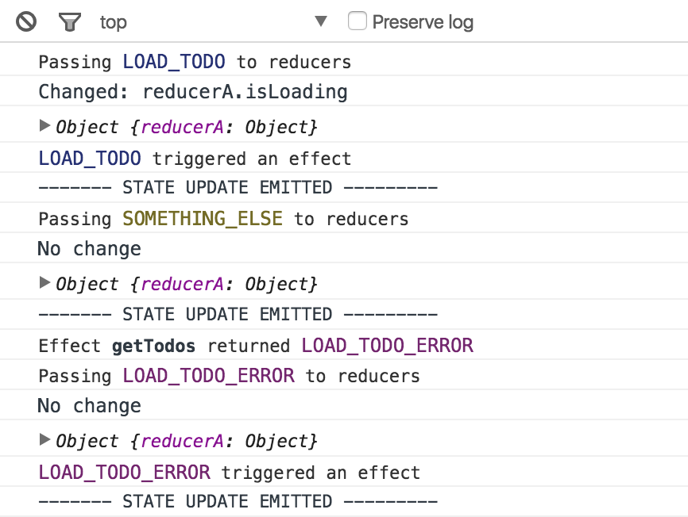

# rxjs-app
A tiny lib to build webapps using rxjs

### Motivation
Observables, unidirectional dataflow, reducers, effects and functional programming are serious buzz words these days. This project is a minimum implementation of these concepts using [rxjs](https://github.com/Reactive-Extensions/RxJS) version 5, soon to be released.

### Status
This library is currently an experiment. If you like the ideas it is quite easy to contribute.

1. Clone repo
2. `npm install`
3. `npm start` (runs demo app)

There are currently no tests due to its simple implementation.

### Get up an running
`npm install rxjs rxjs-app`

```js
import { init } from 'rxjs-app';

const stateStream = init({
  reducers: {},
  effects: {}
});

stateStream.subscribe(state => {
  // Render your UI using the state
});
```

#### Creating actions
An action is just a constant. Typically you put these in their own `constants.js` file:

```js
export const LOAD_TODOS = 'LOAD_TODOS';
export const LOADED_TODOS = 'LOADED_TODOS';
export const LOAD_TODOS_ERROR = 'LOAD_TODOS_ERROR';
```

#### Adding reducers
A reducer is just a function that receives its current state and an action, returning new state.

```js
const initialState = {
  list: [],
  isLoading: false,
  hasError: false
};

export function todos(state = initialState, action) {
  switch (action.type) {
    case LOAD_TODOS:
      return {...state, isLoading: true};
    case LOADED_TODOS:
      return {...state, isLoading: false, list: action.todos};
    case LOAD_TODOS_ERROR:
      return {...state, isLoading: false, hasError: true};
    default:
      return state;
  }
}
```

#### Wiring up the reducers and trigger actions
```js
import { init, dispatch } from 'rxjs-app';
import todos from './reducers/todos';

import {
  LOAD_TODOS
} from './constants';

const stateStream = init({
  reducers: { todos },
  effects: {}
});

stateStream.subscribe(state => {
  // Render your UI using the state
});

dispatch(LOAD_TODOS, { /* Optional payload */ });
```

#### Creating effects
Side effects are handled very differently in different frameworks. In Redux you do it directly in the action creator or use other plugins like [redux-saga](https://github.com/yelouafi/redux-saga) or [redux-loop](https://github.com/raisemarketplace/redux-loop). With `rjxs-app` there is really no magic to it. You hook on to the actions stream and filter out any actions you want to produce a side effect on.

```js
import axios from 'axios';
import { Observable } from 'rxjs';
import { effect } from 'rxjs-app';
import {
  LOAD_TODOS,
  LOADED_TODOS,
  LOAD_TODOS_ERROR
} from './constants';

// The effect function just filters the actions stream on the
// action types passed in
export default effect(LOAD_TODOS)
  .map(action => {
    // We map to an ajax call
    return Observable.fromPromise(axios.get('/todos'));
  })
  .map(response => {
    // We return an action definition
    return {
      type: LOADED_TODOS,
      todos: response.result
    };
  })
  .catch(() => {
    // If an error occurs we return an observable
    // of an action (this is just how catch works)
    return Observable.of({
      type: LOAD_TODOS_ERROR
    });
  })
```

So effects are not returned from a state change, they run as actions are dispatched. The returned action from an effect will also be dispatched and can be handled by other effects, be handled by a reducer or just be ignored.

```js
import { init, dispatch } from 'rxjs-app';
import todos from './reducers/todos';
import getTodos from './effects/getTodos';

import {
  LOAD_TODOS
} from './constants';

const stateStream = init({
  reducers: { todos },
  effects: { getTodos }
});

stateStream.subscribe(state => {
  // Render your UI using the state
});

dispatch(LOAD_TODOS, { /* Optional payload */ });
```

#### Understanding the flow
`rxjs-app` will log out flow information in the console.



Basically you get information about:

- What actions are triggering one or more effects
- What actions are causing a state change, where it happens and you also get the new state
- What actions are returned from a specific effect, causing a new loop
